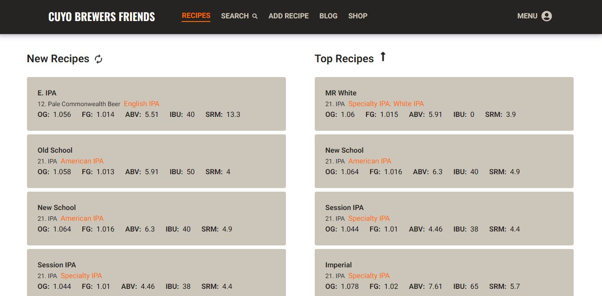

### Hi there 👋, I'm Facundo!

# Full Stack Developer

- I am very curious
- Always willing to learn more
- I like challenges and solving problems
- I don't like giving up

🌱 Skills:

JavaScript | CSS | HTML | Git | React | Redux | Node.js | Express | SQL | PostgreSQL
| Metodologías Agiles (Scrum) | Typescript | MongoDB

I am learning new stuff everyday to become a great full stack developer.

### Portfolio: facupelli-portfolio.vercel.app

### 💼 Projects:

## WebService

### Services e-commerce

 

## Cuyo Brewers Friends

### Recipe builder, post, comment and rate recipes

 

## Dog APP

### API thedogapi.com

 

# 📫 Connect with Me:

    Email: facundopellicer4@gmail.com
    Linkedin: Facundo Pellicer

<a href="https://facupelli-portfolio.vercel.app/"><h3>My Portfolio</h3></a>
<a href="https://www.linkedin.com/in/facundo-pellicer-full-stack-developer/"><h3>My Linkedin Profile</h3></a>
